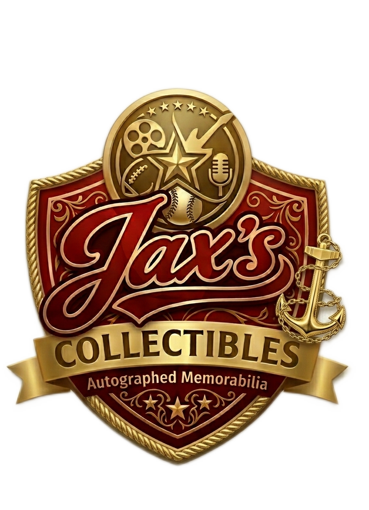

<p align="center">
  
</p>

<h1 align="center">JaxsCollectibles</h1>

<p align="center">
  A modern e-commerce storefront for collectibles — built on Next.js 15, React 19, and Supabase.
</p>

<p align="center">
  
  
  
  
  
  
</p>

---

## Overview

JaxsCollectibles is a full-stack e-commerce platform under the **AvertXAI** umbrella, designed for buying and browsing rare collectibles. It features a polished storefront, a protected admin panel, cart management with optimistic UI, and Supabase-backed auth and data.

## Features

- **Storefront** — product listings, detail pages, and search
- **Cart** — optimistic UI with Supabase sync
- **Auth** — Supabase email + OAuth (Google), with protected routes via Next.js middleware
- **Admin panel** — product, order, and user management behind a session-guarded admin UI
- **Demo checkout** — Stripe integration scaffolded; checkout intercepted for demo stability
- **Docker-ready** — multi-stage Dockerfile for VPS deployment (Coolify / Hetzner)

## Tech Stack

| Layer | Tech |
|---|---|
| Framework | Next.js 15 (App Router) |
| UI | React 19, Tailwind CSS 3.4, shadcn/ui |
| Backend logic | "Brain" mechanics pattern (`/brain`) |
| Database & Auth | Supabase (PostgreSQL + RLS) |
| Styling | Custom `jax` palette, dark mode support |
| Deployment | Docker, Node 20 Alpine |

## Getting Started

### Prerequisites

- Node.js 20+
- A [Supabase](https://supabase.com) project

### Environment Variables

Create `.env.local` in the project root:

```env
NEXT_PUBLIC_SUPABASE_URL=your_supabase_url
NEXT_PUBLIC_SUPABASE_ANON_KEY=your_anon_key
SUPABASE_SERVICE_ROLE_KEY=your_service_role_key
```

> `SUPABASE_SERVICE_ROLE_KEY` is server-only and must never be exposed to the client.

### Run Locally

```bash
npm install
npm run dev
```

Open [http://localhost:3000](http://localhost:3000).

### Build for Production

```bash
npm run build
npm start
```

### Docker

```bash
docker build -t jaxscollectibles .
docker run -p 3000:3000 --env-file .env.local jaxscollectibles
```

## Architecture

All backend logic is organized as modular **mechanics** under `brain/`, grouped by domain:

```
brain/
  admin/       # Admin-only operations
  auth/        # Auth helpers
  cart/        # Cart sync and management
  products/    # Product queries and mutations
  users/       # User profile operations
  db/
    cortex.ts       # SSR Supabase client (respects RLS)
    adminCortex.ts  # Service-role client (admin only)
```

Components never import Supabase directly — all data access goes through brain mechanics.

## Scripts

```bash
npm run dev     # Development server
npm run build   # Production build
npm run lint    # ESLint
```

---

<p align="center">
  &copy; 2026 AvertXAI. All rights reserved.
</p>
